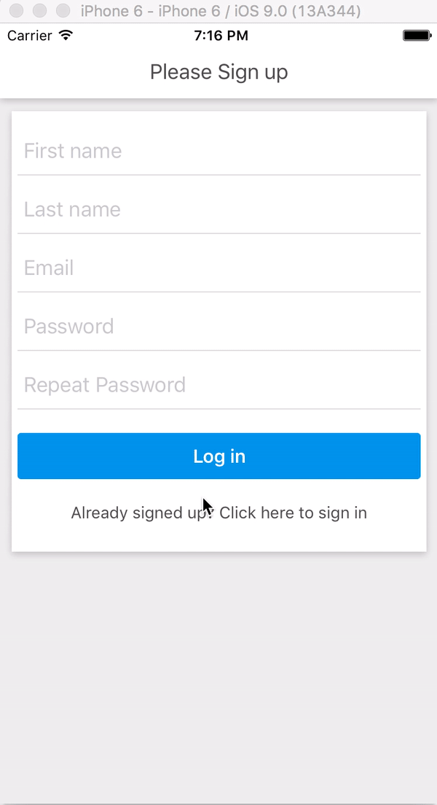

# Trabalho Final da Disciplina de Desenvolvimento Mobile

O aplicativo proporciona uma experiência descomplicada, apresentando uma interface inicial com opções de login e cadastro de usuários. Após efetuar o login, os usuários têm a flexibilidade de criar, editar e excluir posts, que desempenham o papel de tarefas. Essa funcionalidade possibilita uma administração eficaz das informações, fornecendo uma plataforma intuitiva para organizar e gerenciar as atividades dos usuários de maneira conveniente. Para aqueles que ainda não possuem cadastro, o aplicativo oferece uma tela dedicada para facilitar o processo de registro.

## Features

- Integração com FireBase;
- Navegação entre telas;
- Redux ou qualquer outra abordagem de gerenciamento global da aplicação
  correlata ao Flux;
- Noções de layout Flex ou Grid.

## Preview



## Getting started

### Clone Repo

````
git clone 
````

### npm install dependencies

````
npm install
````

## Firebase

### Criando o firebase app

- Você precisará do JavaScript (web ou Node.js) para criar no Firebase.
- Encontre o arquivo firebase.example.json no diretório src, renomeie-o para firebase.json e edite-o com a configuração do seu aplicativo firebase.

### Adicionar regras ao banco de dados Firebase

No console do Firebase, navegue até Banco de dados -> Regras e adicione o seguinte trecho de código.

````
{
  "rules": {
    "users": {
      "$uid": {
        ".read": "$uid === auth.uid",
        ".write": "$uid === auth.uid"
      }
    }
  }
}
````

## Rodando o app

### IOS

````
react-native run-ios
````

### Android

````
react-native run-android
````

### Testing

````
npm run test
````

### Linting

````
npm run lint
````
